

## Presentation

Hopper is a tool that will assist you in your static analysis of executable files.

This quick presentation will give you a good overview of what is Hopper, and how it works.

Hopper is a rich-featured application, and all cannot be discussed here, but don’t worry, you’ll quickly find your marks, and easily discover all its subtleties.

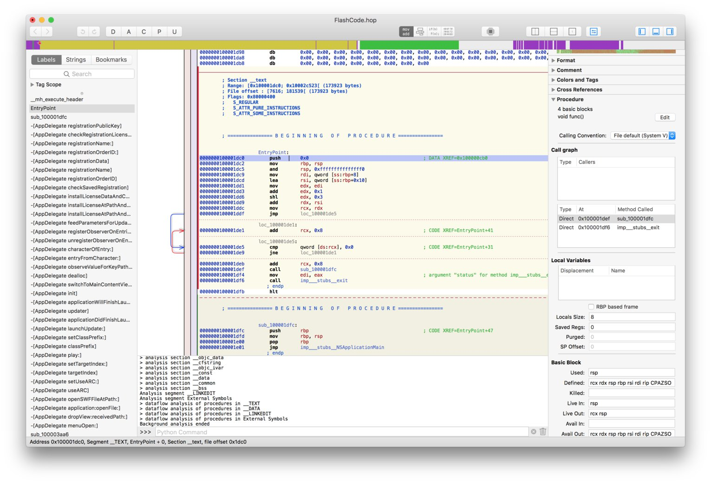

The interface is split into three main areas:

- **The left pane** contains a list of all the symbols defined in the file, and the list strings. The list can be filtered using *tags* and *text*.
- **The right pane** is called the inspector. It contains contextual information about the explored area.
- **The center part** is where the assembly language, and its various representations are displayed.

## The Concept

The idea behind Hopper is to transform a set of bytes (the binary you want to analyze) into something that could be read by a human.

To do so, Hopper will try to **associate a type to each byte of the file**. Because it would be much too expensive to do it manually, Hopper proceeds to an automatic analysis as soon as you loaded a file.

The various types that can be used in hopper are:

- **Data**: an area is set to the *data* type when Hopper thinks it is an area that represents a constant, like an array of *int* for instance.
- **ASCII**: a NULL-terminated C string.
- **Code**: an instruction
- **Procedure**: a byte receives this type once it has been determinate that it is part of a method that has been successfully reconstructed by Hopper.
- **Undefined**: this is an area that has not yet been explored by Hopper,

As soon as an executable is loaded, you can manually change the type, by using either the keyboard, or the toolbar on top of the window.

The toolbar contains one button by type you can set (**D** for *data*, **A** for *ASCII*, etc.). These letters are also the keyboard shortcut you can directly use.).

The *data* type has a little specific behavior: the first time you use this type, Hopper will transform the area into a byte. If you use it again, the byte will be transformed into a 16 bits integer, then a 32 bits integer, and so on…

Feel free to play with transformations to explore the executable: Hopper provides an **undo / redo** feature.

# Display Modes

Reading assembly language is a little bit difficult, and boring in some cases. In order to help you, Hopper can use different kinds of representations for the code.

Most of them require the construction of a procedure, because procedures contain additional information about the structure of the code, like basic blocks, or stack usage.

The current mode can be changed using the toolbar:

 

## Assembly

The first mode is the **Assembly Mode**. Hopper prints the lines of assembly code, one after the other. This is what most disassemblers provide.

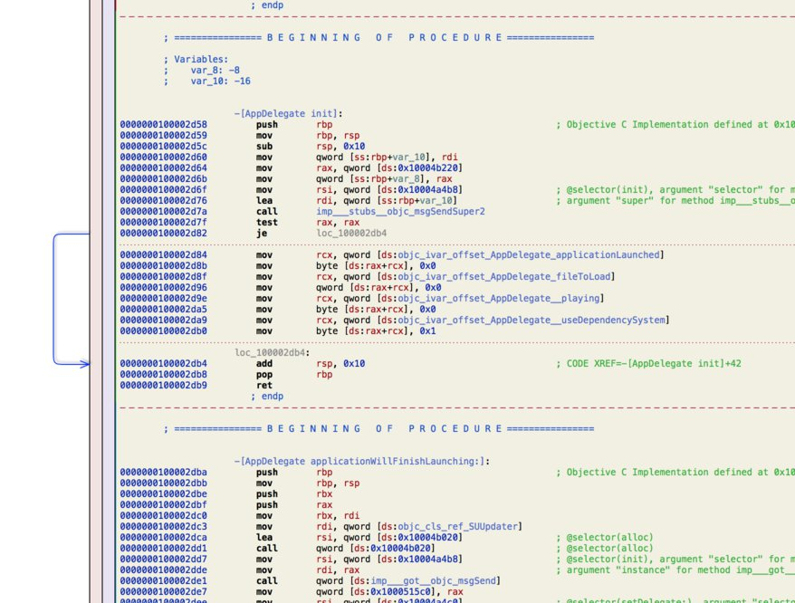

The first column (blue numbers) represents the addresses of the instructions. In front of each of them, the instruction, and its operands (or arguments). As an option, in the preferences of the application, you can choose to print the instruction encoding between the address, and the instruction mnemonic.

In the margin, you'll see some colored arrows. These arrows represent the possible destination of a jump instruction. For instance, on the above screenshot, the blue arrow between addresses **0x100002d82**, and **0x100002db4** represents the fact that the instruction **je** at **0x100002d82** may jump to the address **0x100002db4** if the conditions are met. When an instruction jumps to a greater address (a forward jump), the arrow is drawn in blue. If the jump goes forward, the arrow is drawn in red.

Note that, in this representation, if you click in the red column, you'll set a breakpoint at the corresponding address, and if you click in the blue column, you'll set a bookmark.

## Control Flow Graph

The **CFG mode** represent a procedure in a more structured way.

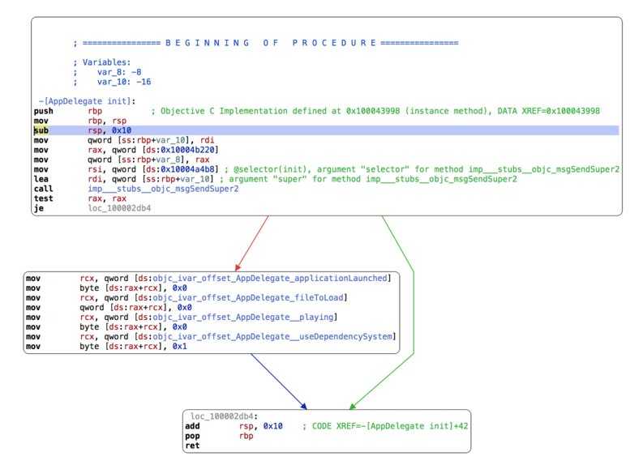

You can still edit things in this representation, like comments and labels. The cursor can be moved from one basic block to another; simply move the cursor to the bound of the current basic block, and use the arrow key of your keyboard to jump to the nearest basic block. If you press the up, or down key, the cursor will move to the nearest basic block, **but keeping the same column**. For instance, in the following case, the cursor will move like indicated:

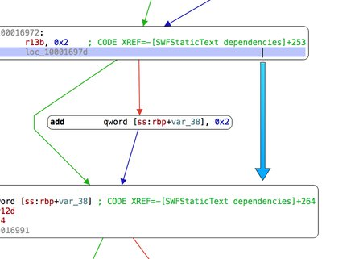

The same behavior applies for the left, and right keys.

In the right panel (the inspector), you'll find a section dedicated to the mode. The **Control Flow Graph** component displays a smaller representation of the current procedure, called **minimap**. Each square represents a basic block, and lines are drawn to represents their connections. One of them is filled in blue: this is the basic block containing the cursor. A light gray square represents the current portion of the method drawn in the main part. You can move the viewport by clicking direcly in this map.

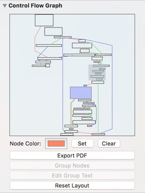

The nodes of the graph can be modified. For instance, it is possible to group some of them when you think that they are closely related. Select the nodes, and click on the **Group Nodes** button in the inspector.

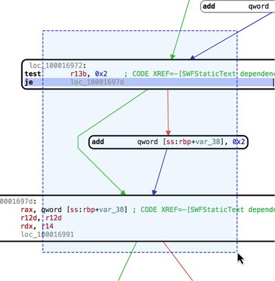

You can also set a custom background color to a given node, or edit the printed text.

## Pseudo-Code

In this representation, Hopper will try to produce some pseudo-code, functionally equivalent to the original CPU instructions, but more or less like an Objective-C method.

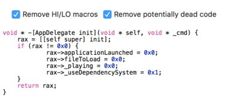

This is clearly the easiest way of reading code you are analyzing, but you should remind that there is no magic: sometimes, it is not possible to construct a perfect pseudo-code representation of a procedure, and some parts may disappear, because Hopper wrongly thought that it was unreachable code (also called **dead code**). In order to mitigate this problem, you can try to toggle the corresponding checkbox at the top of the view.

## Hex Mode

This mode allows you to take a look directly at the bytes of the file.

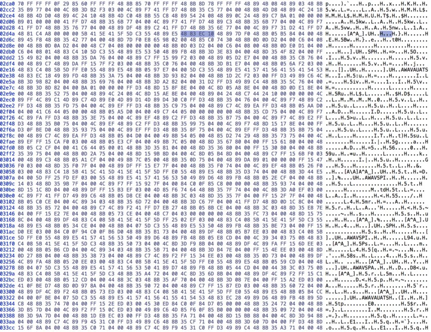

The first column represents the offset in the file, and the other columns, each of the bytes. When you put the cursor on a byte, you'll notice that the selection automatically extends to the left, and to the right. Indeed, Hopper knows more about the file than any regular hexadecimal editor, and for instance, on the previous screenshot, Hopper knows that the cursor is inside an instruction, and selects all of its bytes.

If you double-click on a byte, you can change its value. In some case, it may destroy the underneath structure. For instance, if your cursor was in an instruction, the instruction is automatically destroyed, and the associated Hopper's type falls back to the **undefined** state. Also, if the instruction was part of a procedure, the procedure is destroyed. Anyway, keep in mind that you can always roll back your changes, as Hopper provides an undo / redo feature.

The number of columns in this representation depends on the width of the window; this is the default behavior, but this can be changed in the application preferences. For instance, you can force Hopper to always display 16 columns, whatever is the width of the window.

# Navigating Through the File

## Segments and Sections

An executable file is split into smaller pieces of data, called **segments**, and **sections**.

When the operating system loads an executable, some parts of its bytes are mapped into memory. Each contiguous piece of the file mapped into memory is called **segments**. These segments are split into smaller parts, called **sections**, which will receive various access properties.

You can navigate through these objects by using the **Navigate \> Show Segment List** and **Navigate \> Show Section List** menu items.

## Symbols, Tags and Strings

Because it would be too difficult to remember the address where each piece of code lies into the executable, you can affect **names**, or **symbols** to the addresses.

To name an address, you just need to put the cursor on the address, and press **N**. A dialog will pop up: simply type the name you want to set.

The symbol list is accessible in the left pane of the window.

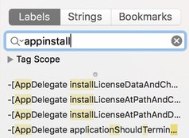

Using the *search field*, you can filter the symbols listed below. Hopper uses a kind of regular expression to filter the list; first, it will present the items that completely contain the term you wrote. Then, right below, the list of symbols that contain one text insertion, then two insertions, and so on. This is what I called the *fuzzy search*, and this behavior can be disabled in the preferences of the application.

You can use the **tags** to filter even more efficiently the symbol list. Tags are textual information that can be put on an address, a basic-block of a procedure, or a whole procedure. You can open the **Tag Scope** element to see all tags that exists in the current document. If you select a tag, only procedures that contain this tag will be listed. Note that if you close the **Tag Scope** item, the filter is reset to *all tags*.

An interesting thing to note is that many tags are automatically generated during the loading process of an executable. For instance, every entry points will receive a specific **entrypoint** tag, and each implementation of each Objective-C class will be tagged with the name of the class (or category). It allows you to quickly navigate through code written in Objective-C!

You can choose to display the **strings** contained in the file. In this mode, only the ASCII strings are displayed, and the **Tag Scope** has no effect.

## The Navigation Stack

You can jump to an address, or a symbol by **double-clicking** on it. The address where the cursor was located, is pushed on a stack. You pop this stack, and navigate back by using the **escape key** or the **backspace key** on your keyboard. You can also use the navigation toolbar items.

The right arrow will jump to the address under the cursor, and the left arrow will come back.

## The Navigation Bar

Just above the assembly, you’ll find the **navigation bar**.

This bar is used to quickly navigate into the file. A color scheme is used to indicate the various types given to the bytes of the file.

- **Blue** parts represent code,
- **Yellow** parts represent procedures,
- **Green** parts represent ASCII strings,
- **Purple** parts represent data,
- **Grey** parts are undefined.

A little **red arrow** indicates where the cursor is currently located.

## Using the Inspector

The **inspector** is the rightmost part of the window. It contains various components that will show up, or hidden depending on the context where the cursor is currently located.

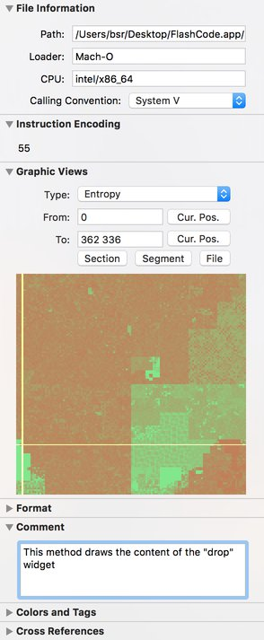

Here is a quick overview of the components that you can find in the inspector:

### Instruction Encoding

This component displays the bytes of the current instruction. If the current processor has multiple CPU modes (like the *ARM* and *Thumb* modes of the *ARM* processor family), you’ll see a popup menu that lets you change the CPU mode at the current address.

### Format

This component is used to change the display format of the operand of an instruction. You can choose between *signed / unsigned hexadecimal*, *decimal*, *octal*, *address*, etc.

### Comment

You can associate a textual comment at a given address. Use this component to edit this comment.

### Colors and Tags

This component lets you associate **tags** to addresses, basic-block of a procedure, or a procedure. Those tags are useful to navigate efficiently through the file.

You can even put some colors on addresses in order to quickly, and visually, distinguish parts of the executable.

### References

This is a very important component; it **shows all the references** that one instruction can have to another instruction, or piece of data. It contains the references in the other way too, *i.e.*, the other instructions that references this one. You can even **add your own references** by hand if the analysis performed by Hopper didn’t find some references.

### Procedure

This component contains the information on the current procedure. For each basic-block, it displays the list of its predecessors and its successors.

At the bottom of the component, you’ll find a very useful button: **Switch/case hint**. This button is enabled on instructions like \**jmp REGISTER*. It allows you to help Hopper to find the statements of a *switch/case* construction.

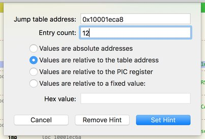 

# Modifying the File

## The Hexadecimal Editor

As previously seen, Hopper provides a **hexadecimal editor**. The editor is synchronized with the assembly language view, and automatically highlights bytes that are part of the current instruction.

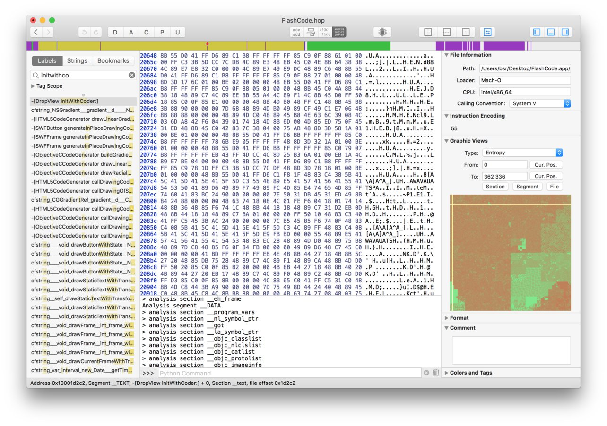

Double-click on a byte to modify it. You can use the Undo/Redo feature if you made a mistake.

## The Assembler

An embedded assembler can be invoked from Hopper from the **Modify \> Assemble Instruction…** menu.

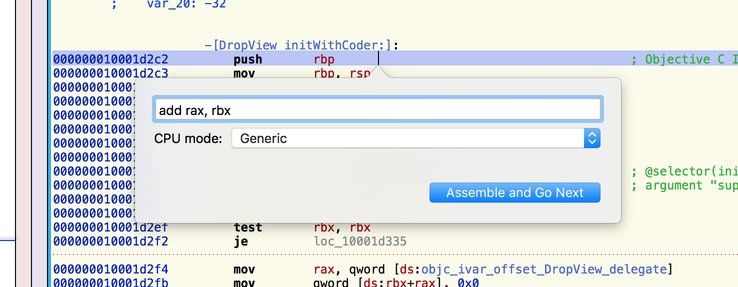

You can also use the **Modify \> NOP Region** menu to replace the currently selected instructions by NOP instructions.
